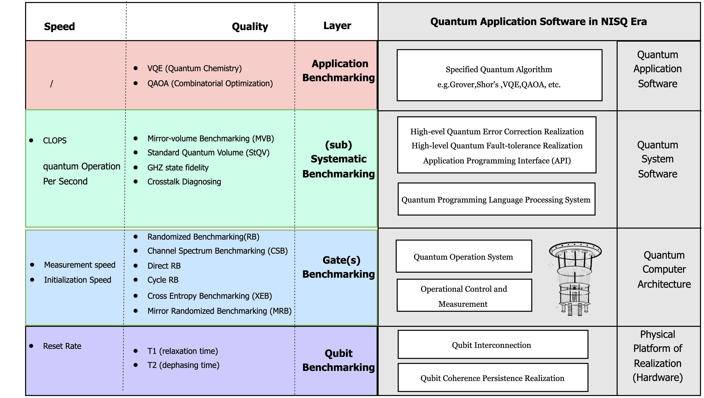

# ErrorGnoMark: Quantum Chip Error Diagnosis & Benchmark

## Overview

ErrorGnoMark (Error Diagnose & Benchmark) is a comprehensive tool developed by the Quantum Operating System Group at the Beijing Academy of Quantum Information Sciences. It aims to provide a complete and thorough benchmark and diagnostic information for quantum chip[^2][^3], covering different layers of the quantum operating system: physical layer, quantum gate (circuit) layer, and application Layer. It evaluates key dimensions such as Scalability, Quality, and Speed[^1]. 

<p align="center">
  
</p>

### Potential Applications

ErrorGnoMark plays a crucial role in the journey toward building a fully functional quantum computer. Below are its key applications:

- **Hardware Control**: Facilitates quantum chip calibration, improves the reliability of simulators, and enables optimal quantum control.

- **Compiler Optimization**: Enhances compiler performance by leveraging error information, such as crosstalk, to optimize quantum gate operations.

- **Cloud & Direct User Access**: Enables precise real-time monitoring of chip performance (e.g., error rates) and supports advanced quantum error correction (QEC) experiments.


## Version Information

**ErrorGnoMark 0.1.0**  
*Note: This is the initial version. Future updates will align with advancements in relevant research fields and evolving application requirements.*

## Installation

### Installation via pip

We recommend installing **ErrorGnoMark** using pip for simplicity and convenience:

```bash
pip install ErrorGnoMark
```

### Installation via GitHub
Alternatively, you can clone the repository from GitHub and install the package locally:

```bash
git clone https://github.com/BAQIS-Quantum/ErrorGnoMark`
```

```bash
cd ErrorGnoMark`
```

```bash
pip install -e
```

### Upgrade to the Latest Version
To ensure you are using the latest features and improvements, update ErrorGnoMark with:
```bash
pip install --upgrade ErrorGnoMark
```


## Running Example Programs

To verify the installation, you can run example programs:

```bash
cd example
```

```bash
QC-lmc.py
```

### Overview

Before using **ErrorGnoMark** for quantum error diagnosis, we recommend users begin with the introduction to familiarize themselves with the platform. The **Quick Start Guide** provides step-by-step instructions for using the quantum error diagnosis service and building your first program. Afterward, users are encouraged to explore application cases provided in the tutorials. Finally, users can apply **ErrorGnoMark** to address specific research and engineering challenges. For detailed API documentation, refer to the official API documentation page.

### Tutorials

**ErrorGnoMark** offers a range of tutorials, from beginner to advanced topics. These tutorials are available on the official website, and users interested in research or development are encouraged to download and utilize Jupyter Notebooks.

#### **Table of Contents**
- **Overview of Quantum Chip Errors**: Technical adjustments, common issues, and solutions.
- **Quantum Benchmarking**:
  - **Hardware Layer Characterization**: Analyzing hardware performance metrics.
  - **Quantum Gate (Circuit) Benchmarking**[^3]: Evaluating the fidelity and reliability of gate-level operations.
  - **Quantum Chip Application Performance Testing**: Testing and validating chip performance for practical applications.

- **Databases for Benchmarking and Characterization**:
  In the context of calibration, **ErrorGnoMark** focuses on combining {characterization + benchmarking} data to build two types of databases:
  
  - **Characterization Data**: 
    - This data includes pulse-level control parameters such as \(T_1\) and \(T_2\) times and other metrics critical for understanding quantum hardware performance and limitations.
  
  - **Benchmarking Data**: 
    - This data consists of various benchmark scores at the gate level, providing quantitative measures of gate performance and system reliability.

These databases are structured to distinguish between **pulse-level** and **gate-level** data:
- **Gate-Level Compilation**: Directly utilizes benchmarking data for gate optimization.

- **Pulse-Level Compilation**: Focuses on quantum optimal control, leveraging characterization data to fine-tune and enhance quantum operations.


## Feedback

We encourage users to provide feedback, report issues, and suggest improvements through the following channels:

- **GitHub Issues**: Use the [GitHub Issues](https://github.com/BAQIS-Quantum/ErrorGnoMark/issues) page to report bugs, suggest new features, or share improvement ideas.
- **Email**: Contact us directly at **chaixd@baqis.ac.cn** for questions or additional support.

Collaboration with the community is vital to the continuous improvement of **ErrorGnoMark**. Your input will help us make the tool better and more impactful for the quantum computing community!


## License

ErrorGnoMark is licensed under the Apache License.

## References

[^1]: **Quality, Speed, and Scale: Three key attributes to measure the performance of near-term quantum computers**, Andrew Wack, Hanhee Paik, Ali Javadi-Abhari, Petar Jurcevic, Ismael Faro, Jay M. Gambetta, Blake R. Johnson, 2021, [arXiv:2110.14108](https://arxiv.org/abs/2110.14108) [quant-ph].

[^2]: **Optimizing quantum gates towards the scale of logical qubits**, Klimov, P.V., Bengtsson, A., Quintana, C. et al., *Nature Communications*, 15, 2442 (2024). [https://doi.org/10.1038/s41467-024-46623-y](https://doi.org/10.1038/s41467-024-46623-y).

[^3]: **Benchmarking universal quantum gates via channel spectrum**, Yanwu Gu, Wei-Feng Zhuang, Xudan Chai & Dong E. Liu , *Nature Communications*, 14, 5880 (2023). [https://doi.org/10.1038/s41467-023-41598-8](https://doi.org/10.1038/s41467-023-41598-8).


### Releases

This project follows a systematic release process to ensure users always have access to the latest stable version.

