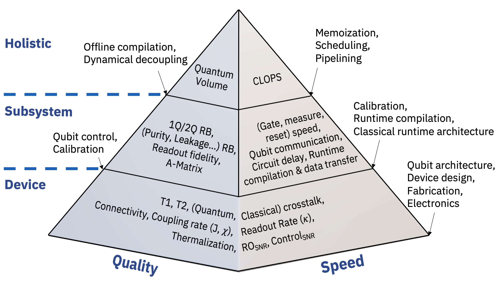
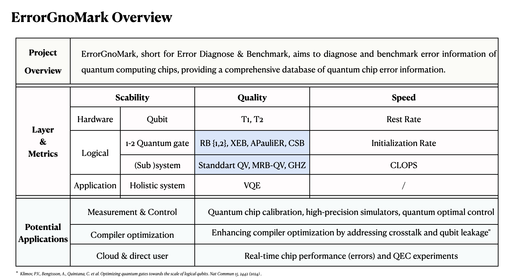

## 语言

- [English｜简体中文](https://github.com/ChaiXD0137/ErrorGnoMark/blob/master/README_CN.md)

---

# ErrorGnoMark: 量子芯片错误诊断与基准测试

## 概述

ErrorGnoMark（错误诊断与基准测试）是由北京量子信息科学研究院的量子操作系统与软件开发团队开发的综合工具。它旨在提供全面的量子芯片错误基准和诊断信息，涵盖量子操作系统的不同层次：物理层、量子门（电路）层和应用层。该工具评估了扩展性、质量和速度等关键维度[^1]。

  

### 潜在应用

  

- **硬件控制**: 量子芯片校准过程，构建更可靠的模拟器，优化量子控制等。
- **编译器优化**: 通过串扰等错误信息提高编译器优化性能。
- **云端和直接用户访问**: 实时监控芯片性能（错误），QEC实验等。

## 版本信息

**ErrorGnoMark v1.0**  
注意: 这是初始版本。未来的更新将根据相关研究领域的进展和应用需求进行。

## 安装

通过 pip 安装

我们推荐使用 pip 安装 ErrorGnoMark：

\`\`\`sh
pip install ErrorGnoMark
\`\`\`

或者，您可以从 GitHub 下载所有文件并本地安装：
\`\`\`sh
git clone git@github.com:ChaiXD0137/ErrorGnoMark.git
cd ErrorGnoMark
pip install -e .
\`\`\`

<!-- ## 升级
如果您已经安装了 ErrorGnoMark，可以使用以下命令升级：
pip install --upgrade ErrorGnoMark -->

## 运行示例程序
要验证安装，您可以运行示例程序：
\`\`\`sh
cd Example
1-example-CSB-q2.py
\`\`\`

## 入门和开发

### 概览

在使用 ErrorGnoMark 进行量子错误诊断之前，我们建议用户先阅读介绍以了解该平台。快速入门指南将指导您使用量子错误诊断服务并构建您的第一个程序。接下来，我们鼓励用户探索教程中提供的更多应用案例。最后，用户可以应用 ErrorGnoMark 来解决研究和工程问题。详细的 API 文档请参阅我们的 API 文档页面。

### 教程

ErrorGnoMark 提供了从基础到高级主题的详细教程，可在我们的网站上找到。我们推荐对研究或开发感兴趣的人下载并使用 Jupyter Notebook。

**目录**:

- 量子芯片错误概述（技术调整、问题和解决方案）

- 量子基准测试
  - 物理层基准测试
  - 量子门（电路）基准测试
  - 量子芯片应用性能测试

- 硬件控制中的基准测试评分和表征数据库  
  在校准的背景下，我们的重点是{表征+基准测试}数据。可以将其构建成两类数据库。

  - **表征数据**：这涉及脉冲级别的控制参数，如T1和T2时间等其他控制指标。这些参数对于理解量子硬件的基本性能和限制至关重要。
  - **基准测试数据**：包括各种门级的基准评分，提供量子门性能和系统整体可靠性的定量评估

  这些数据库的结构清晰地划分了脉冲级和门级数据。在门级编译中，系统直接利用基准测试数据。然而，在脉冲级编译中，重点转向量子优化控制，利用表征数据进行微调和增强量子操作。

### 应用场景

众所周知，开发量子计算机的一个重大挑战是实现对量子设备的精确控制。噪声和由此产生的错误往往导致量子操作（如量子门）的性能低于预期。噪声的复杂性及其来源，以及错误发生的机制，限制了我们对量子设备的理解，使我们难以全面掌握其行为。因此，我们正在开发的 ErrorGnoMark 工具将在实现功能性量子计算机的每一步中发挥重要作用。以下是 ErrorGnoMark 工具的潜在应用：

- **硬件控制**: 量子芯片校准，构建可靠的模拟器，优化量子控制等。例如，基准测试模式可以创建门级数据库[^2]，而脉冲级模式可以表征诸如去相干等控制参数
- **编译器优化**: 通过错误信息（如串扰）提高性能。
- **云端和直接用户访问**: 实时芯片性能监控，QEC 实验等。

## 反馈

我们鼓励用户通过 GitHub 问题或发送电子邮件至 chaixd@baqis.ac.cn 提供反馈、报告问题和提出改进建议。与社区的合作将有助于使 ErrorGnoMark 变得更好！

## 常见问题

**问: 如何开始使用 ErrorGnoMark？**  
答: 我们建议您访问我们的网站并按照以下路线图进行操作：

1. **步骤 1**: 阅读快速入门指南，了解如何访问 ErrorGnoMark。
2. **步骤 2**: 研究单量子比特控制和双量子比特门的性能。
3. **步骤 3**: 探索高级应用，包括脉冲级别的基准测试和 VQE 算法性能评估。

## 更新日志

ErrorGnoMark 的更新日志可以在 `CHANGELOG.md` 文件中找到。

## 许可证

ErrorGnoMark 是在 GPL-3.0 许可证下授权的。

## 参考

[^1]: **Quality, Speed, and Scale: Three key attributes to measure the performance of near-term quantum computers**, Andrew Wack, Hanhee Paik, Ali Javadi-Abhari, Petar Jurcevic, Ismael Faro, Jay M. Gambetta, Blake R. Johnson, 2021, arXiv:2110.14108 [quant-ph].

[^2]: **Optimizing quantum gates towards the scale of logical qubits**, Klimov, P.V., Bengtsson, A., Quintana, C. et al. . Nat Commun 15, 2442 (2024). https://doi.org/10.1038/s41467-024-46623-y

## 关于

一个用于执行量子芯片基准测试和错误诊断的项目。
